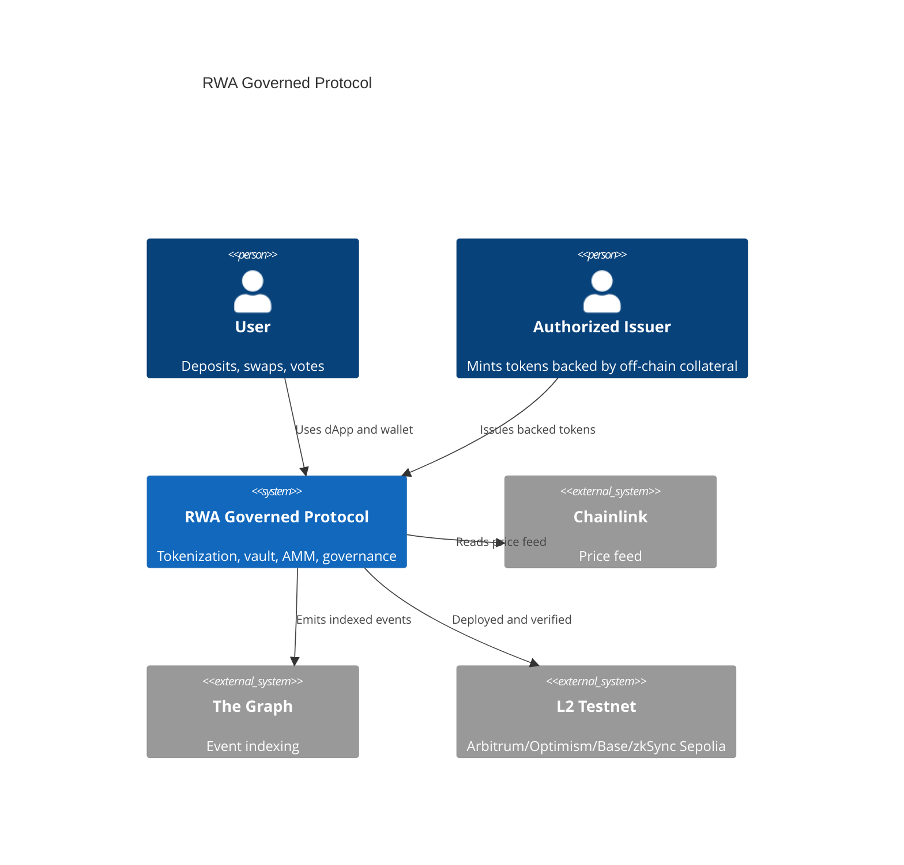
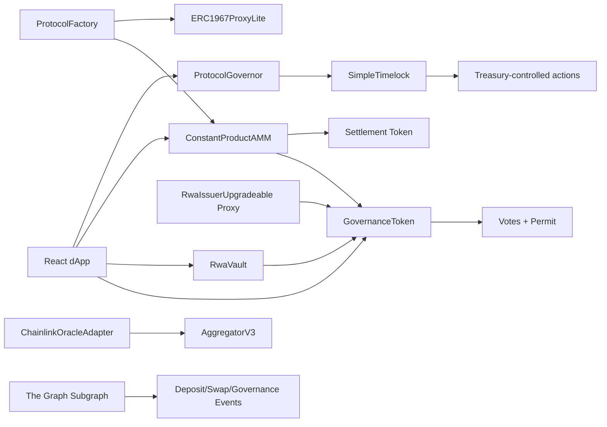
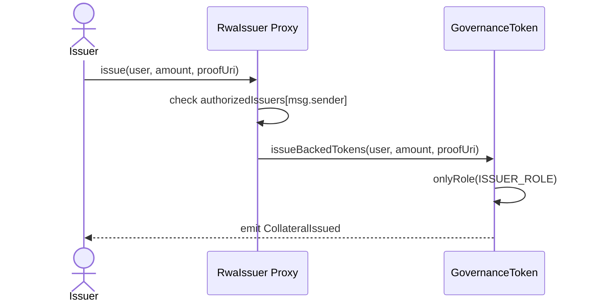
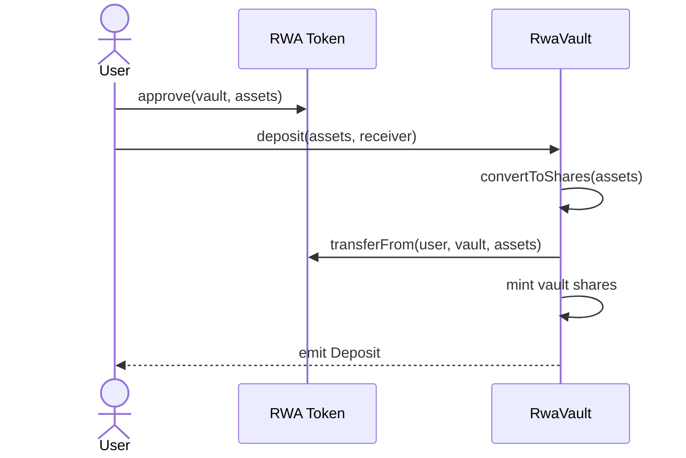
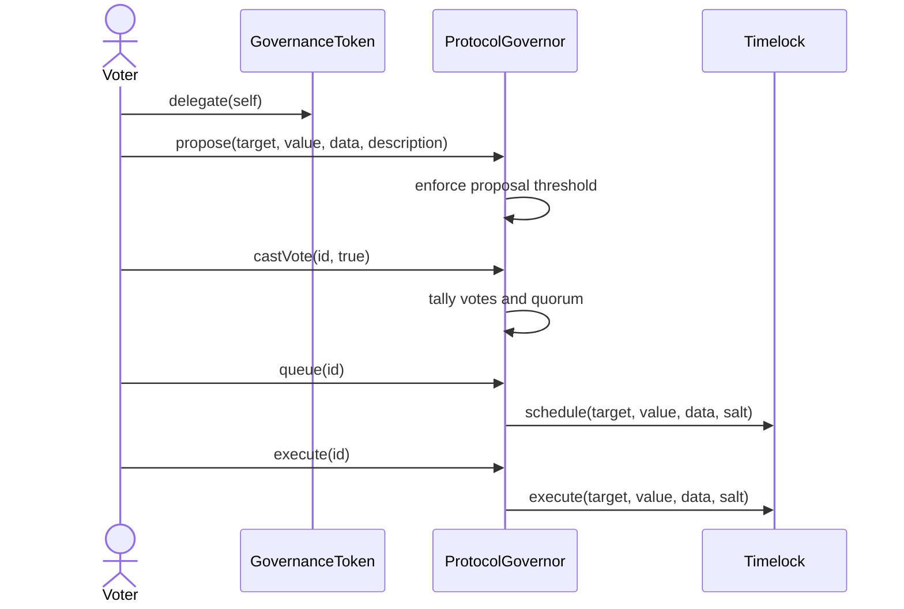

# Architecture and Design Document

## 1. System Context

The protocol tokenizes real-world collateral into an on-chain governance token, lets users deposit that token into a yield vault, trade it against a settlement token in an AMM, and govern treasury and issuer changes through a timelock.



## 2. Containers and Components



## 3. Contract Relationships

`GovernanceToken` is the central asset and voting token. It grants `MINTER_ROLE` and `ISSUER_ROLE` through `AccessControlLite`. `RwaIssuerUpgradeable` mints through `issueBackedTokens` only after an address has been authorized by the issuer admin.

`RwaVault` wraps the RWA token and issues vault shares. The vault follows ERC-4626 style accounting with `totalAssets`, `convertToShares`, `convertToAssets`, `deposit`, and `withdraw`.

`ConstantProductAMM` supports RWA/settlement-token liquidity. It mints LP shares, charges 0.3% fees, and enforces the constant product invariant after swaps.

`ProtocolGovernor` reads token voting power and controls queued execution through `SimpleTimelock`. The parameters match the brief: 1 day voting delay, 1 week voting period, 4% quorum, 1% proposal threshold, 2 day timelock delay.

`ProtocolFactory` demonstrates both deployment patterns: normal `new ConstantProductAMM(...)` through CREATE and deterministic `new ERC1967ProxyLite{salt: salt}(...)` through CREATE2.

## 4. Proxy Layout and Upgradeability

The issuer uses an ERC-1967 implementation slot:

```text
bytes32(uint256(keccak256("eip1967.proxy.implementation")) - 1)
```

Storage layout:

| Slot | Variable | Contract |
| --- | --- | --- |
| 0 | `token` | `RwaIssuerUpgradeable` |
| 1 | `admin` | `RwaIssuerUpgradeable` |
| 2 | `version` | `RwaIssuerUpgradeable` |
| 3 | `authorizedIssuers` mapping seed | `RwaIssuerUpgradeable` |
| 4-48 | `__gap` | reserved |

`RwaIssuerV2` appends functions without adding conflicting storage. The reserved gap protects future upgrades from storage collision.

## 5. Critical User Flow: Issue RWA Tokens



## 6. Critical User Flow: Deposit Into Vault



## 7. Critical User Flow: Propose, Vote, Queue, Execute



## 8. Storage Model

`GovernanceToken` stores balances, allowances, roles, delegates, nonces, and voting power. The voting model is current-vote based and intentionally lightweight for the course implementation.

`RwaVault` stores share balances inherited from `ERC20Base`, immutable asset address, fee recipient, and fee bps.

`ConstantProductAMM` stores token addresses, reserves, and LP token balances.

`ProtocolGovernor` stores proposals and per-proposal vote receipts.

`SimpleTimelock` stores operation timestamps keyed by operation hash.

## 9. Trust Assumptions

Authorized issuers are trusted to mint only when off-chain collateral exists. Governance can rotate issuers, tune parameters, and control treasury actions after a two-day delay. Users trust Chainlink feed freshness checks and the social/legal process behind collateral proofs.

If the admin or issuer key is compromised before control is transferred to the timelock, unauthorized issuance is possible. Production deployment must transfer admin roles to the timelock and use multisig-controlled proposer permissions.

## 10. Design Decisions

ADR-001: Option C selected because RWA tokenization covers ERC20, ERC4626, oracles, access control, governance, and L2 deployment naturally.

ADR-002: A lightweight internal ERC20/Governor stack is used to keep the project self-contained for grading environments without npm or forge dependency installation.

ADR-003: AMM is included even though Option C does not require one directly because Section 3 requires a DeFi primitive built from scratch.

ADR-004: UUPS-style issuer proxy is isolated from token/vault logic to reduce upgrade blast radius.

ADR-005: The Graph indexes high-value events: deposits, swaps, proposals, and token state.

## 11. Design Pattern Matrix

| Pattern | Implementation | Rationale |
| --- | --- | --- |
| Factory | `ProtocolFactory.createAMM`, `createUUPSProxy` | Keeps protocol deployment reproducible and demonstrates deterministic CREATE2 addresses for upgradeable modules. |
| Proxy / UUPS | `ERC1967ProxyLite`, `RwaIssuerUpgradeable`, `RwaIssuerV2` | Isolates issuer business logic so issuer rules can evolve without migrating token, vault, or AMM state. |
| Checks-Effects-Interactions | `RwaVault.withdraw`, `ConstantProductAMM.swap`, `SimpleTimelock.execute` | State is updated before external token or target calls wherever value can move. |
| Access Control | `AccessControlLite` roles on token, NFT, and timelock | Separates issuer, minter, proposer, executor, and admin powers. |
| Timelock | `SimpleTimelock` | Creates a mandatory review window before governance-controlled execution. |
| Reentrancy Guard | `RwaVault`, `ConstantProductAMM`, `FixedBank` | Protects stateful value-moving functions from nested execution. |
| Oracle Adapter | `ChainlinkOracleAdapter` | Wraps Chainlink feed reads with protocol-specific staleness and bad-price checks. |
| State Machine | `ProtocolGovernor.state` | Proposal lifecycle moves through Pending, Active, Defeated, Succeeded, Queued, and Executed. |

## 12. Role Model

The intended production role owner is the timelock. The deployment script performs initial seeding and then removes deployer privileges:

| Role | Initial Holder | Final Holder | Power |
| --- | --- | --- | --- |
| Token default admin | Deployer | Timelock | Grant and revoke token roles |
| Token minter | Deployer | Timelock | Mint governance and settlement tokens |
| Token issuer | Deployer / Issuer Proxy | Timelock / Issuer Proxy | Mint backed collateral tokens |
| NFT default admin | Deployer | Timelock | Manage badge minters |
| NFT minter | Deployer | Timelock | Mint asset badges |
| Timelock proposer | Deployer | Governor | Schedule operations |
| Timelock executor | Deployer | Governor | Execute queued operations |
| Issuer proxy admin | Deployer | Timelock | Authorize issuers and upgrade issuer implementation |

This model prevents a deployer-owned backdoor after the bootstrap phase. In a real deployment, the deployer should be a burner account and the timelock proposer/executor roles should be reviewed immediately after broadcast.

## 13. Storage Layout Details

`GovernanceToken` stores ERC-20 metadata, balances, allowances, role mappings, delegates, nonces, current voting power, and EIP-712 domain data. The current implementation is intentionally lightweight and self-contained, but the audit notes that production governance should migrate to OpenZeppelin checkpointed voting.

`RwaVault` inherits ERC-20 share storage from `ERC20Base`, stores immutable `asset`, immutable `feeRecipient`, and a constant performance fee. The vault has no mutable admin controls, reducing upgrade and governance surface.

`ConstantProductAMM` inherits LP token storage from `ERC20Base` and stores immutable `token0`, immutable `token1`, and `uint112` reserves. Reserve writes are bounded by balance checks in `_sync`.

`SimpleTimelock` stores immutable delay plus operation timestamps keyed by operation hash. It does not store proposal metadata; proposal state lives in `ProtocolGovernor`.

`ProtocolGovernor` stores proposal structs and vote receipts. Proposal calldata is stored directly so the queued operation hash can be reconstructed deterministically.

## 14. Deployment Evidence

Arbitrum Sepolia dry-run succeeded with Foundry against `https://sepolia-rollup.arbitrum.io/rpc`, estimating `13,596,611` gas and about `0.000543864453596611 ETH`. Real broadcast was not performed because the prepared deployer had zero Arbitrum Sepolia ETH.

Local Anvil broadcast succeeded on chain `31337`; addresses and post-deployment check output are recorded in `docs/deployment-addresses.md`. This proves the deployment script is executable and reproducible while the L2 faucet issue remains operational rather than architectural.
